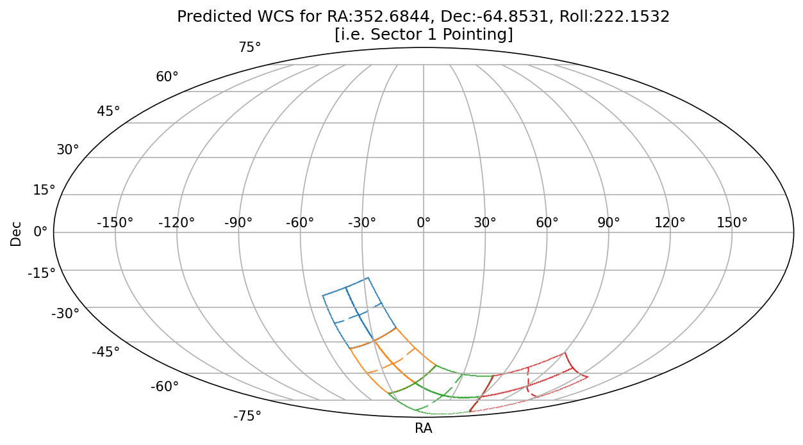

<a href="https://github.com/tessgi/tesswcs/actions/workflows/tests.yml"></a> [](https://tessgi.github.io/tesswcs/)
[](https://badge.fury.io/py/tesswcs)

<p align="center">
  
</p>

# tesswcs

This package will enable you to create an [`astropy` World Coordinate System](https://docs.astropy.org/en/stable/wcs/) for any pointing of the TESS telescope. You can access both the true WCS from archival data, and predict the WCS for a given RA, Dec, and spacecraft roll.

## Installation

You can install `tesswcs` using `pip`

```
pip install --upgrade tesswcs
```

## Usage

Below is an example of how to obtain a WCS for a given sector

```python
import tesswcs

wcs = tesswcs.WCS.from_sector(sector=1, camera=1, ccd=1)
wcs
```

```
WCS Keywords

Number of WCS axes: 2
CTYPE : 'RA---TAN-SIP' 'DEC--TAN-SIP' 
CRVAL : 13.594227829971574 -20.630003889665105 
CRPIX : 1046.0046042531758 1002.004711738613 
PC1_1 PC1_2  : -0.0052945863349177745 0.0022643466111789898 
PC2_1 PC2_2  : 0.002130969047581938 0.005238488386839341 
CDELT : -1.0 1.0 
NAXIS : 2078  2136
```

This returns an `astropy` World Coordinate System object so you can use all the features of `astropy`. For example, using `astropy`'s WCS interface you can now either work with this object, for example you can obtain the sky position of row and column positions

```python
wcs.pixel_to_world(row, column)
```

or obtain row and column positions from sky positions (using the `astropy.coordinates.SkyCoord` object).

```python
from astropy.coordinates import SkyCoord
wcs.world_to_pixel(SkyCoord.from_name("HD 209458"))
```

You can also save these objects to fits files

```python
wcs.to_fits('wcs.fits')
```

If you have a RA, Dec and roll in degrees you can also predict a WCS.

```python
import tesswcs

wcs = tesswcs.WCS.predict(ra=0, dec=0, roll=0, camera=1, ccd=1)
```

You can use tesswcs to better understand what sources will be obervable on TESS pixels, or to make figures like the ones below! [Check out the tutorials](https://tessgi.github.io/tesswcs/tutorial3/) for more information on how to produce these figures.



## What's new?

In version 1.2 and higher `tesswcs` now includes the expected pointing parameters for TESS EM3 (sectors 97-134). These are **expected** pointings and are subject to change. As TESS takes data `tesswcs` will be updated to replace the predicted WCS for future sectors with the measured WCS when data is archived.

## Limits on accuracy

TESS observes large parts of the sky with a rapid cadence during ~27 day sectors. Since the spacecraft orbits the Earth, which in turn orbits the Sun, the spacecraft moving at high velocity. Because of its large field of view, this imparts a differential velocity aberration (i.e. targets at different parts of the detector have a different apparent motion.) `tesswcs` provides a static World Coordinate System solution at the mean time of the observation, which can not account for this differential velocity aberration. This can cause small (usually subpixel) apparent inaccuracies of the pointing over time. As such, `tesswcs` alone can not be used for astrometric measurements with TESS.
